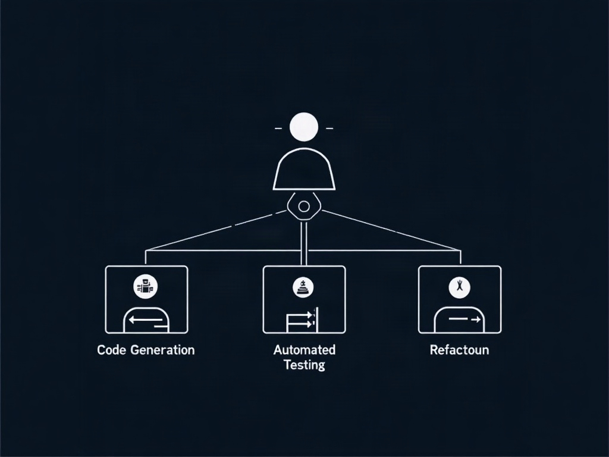

In 2026, the paradigm of software development has shifted dramatically. No longer are developers just writing lines of boilerplate code; instead, they act as orchestrators of autonomous AI agents. These agents handle everything from automated bug fixing and complex refactoring to end-to-end integration testing. 

 *Figure 1: The 2026 software development lifecycle, shifting human roles toward orchestration.* Developers now focus on architectural vision, security compliance, and defining business logic while multi-agent swarms execute the heavy lifting in distributed development environments. >**[IMAGE GENERATION FAILED]:**Figure 2: Autonomous multi-agent swarms executing parallel tasks in distributed repositories.
>
>**Alt:** Flowchart of distributed multi-agent swarm handling bug fixes and integration tests.
>
>**prompt:**A system architecture flowchart illustrating a multi-agent swarm interacting with a central code repository, handling pull requests, security scans, and deployment pipelines autonomously. Clean lines, technical blueprint style, high contrast.
>
>**Error:**Client error '402 Payment Required' for url 'https://router.huggingface.co/fal-ai/fal-ai/flux/dev' (Request ID: Root=1-6a91bc75-485b1cb607a59b3b00e1788f;64305fc4-bbfc-4fd4-9bc9-47d15cd771b7)
For more information check: https://developer.mozilla.org/en-US/docs/Web/HTTP/Status/402

You have depleted your monthly included credits. Purchase pre-paid credits to continue using Inference Providers. Alternatively, subscribe to PRO to get 20x more included usage.
>
 As this trend accelerates, mastering agentic workflows has become the single most valuable skill in the modern software engineering lifecycle.